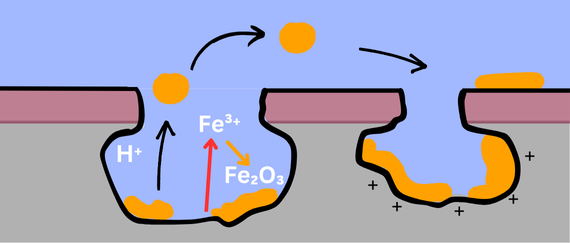
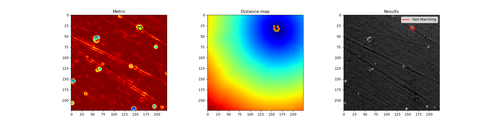
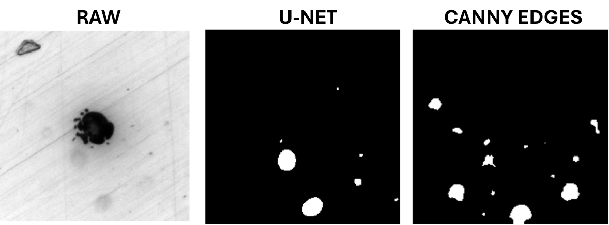

# DEEP LEARNING PROJECT - Corrosion product recognition using CNN and computer vision
## Context 

Pitting corrosion is one of the most aggressive form of corrosion that causes over 2.5 trillion USD loss every year. This corrosion is characterized by the formation of pits from which corrosion particles can be ejected.  
  
<p align="center">
  <strong>Schematic representation of corrosion products ejection :</strong><br><br>
  
</p>  
  
This project has the objective of applying computer vision techniques and CNN in order to accurately recognize corrosion product seen on microscopic images.
The idea is using computer vision and fast marching algorithm in order to annotate corrosion particles semi-automatically. Then build a CNN from scratch that fits best the prediction of these particles.

## Objectives

- Pre-treatment of microscopic images
- Particle detection using open-cv and semi-automatic annotation (0:no Particle, 1:Particle)
- Build a convolutional neural network from scratch (Unet++)
- Performance evaluation of the model (Dice score, accuracy, precision...)
- Fine-tuning of the model (hyper-parameters, architecture)
- Visualisation of the results and tracking performances of the model

## Structure


📁 videos/ – data [](https://doi.org/10.5281/zenodo.14653184)  
📁 dataset/ – 110 images dataset  
📁 models/ – Weights and metrics  
📁 notebooks/ – Initial exploration  
📁 src/ – main code  
📄 README.md  
📄 requirements.txt  

## Dependencies 

- Pytorch
- Numpy
- OpenCV
- Scikit-learn
- Matplotlib
- Albumentations
- segmentation-models-pytorch
- tensorboard
- scikit-image
- seaborn
- eikonalfm
- ipympl

## Dataset file stucture
Raw images and ground thruth masks needs to be in the same folder. Masks should have the mention "mask" in their name and each mask should correspond to a raw image. The dataset file should be structured as follows :  

```python

dataset/  
├── image_1.png  
├── mask_1.png  
├── image_2.png  
├── mask_2.png  
├── image_3.png  
├── mask_3.png
...
```

## Image processing 
In one hand, the full resolution of images are 2448x2452. In another hand the average size of a particle is about tens of pixels maximum. The size ratio between the full resolution and the size of a particle emerges an imbalance problem making the segmentation of particle very difficult.  
For this reason, we sliced each image into multiple smaller images of 224x224 that can be used to train the model. Therefor, particles occupy a much more amount of pixels in the image and facilitate the training.  
The inference will be made on each slice separately before reconstructing the whole image.

## How to use it

### Semi-automatic annotation using fast marching
Fast marching is based on the calculation of intensity gradients.

<p align="center">
  <strong>Contours found by fast marching :</strong><br><br>
  
</p>  

From right to left : area of high intensity gradients, distance map and contours found by fast marching method (background subtracted from the image).
A demonstration of the script is also available at [](https://colab.research.google.com/github/AnesSAD/Pitting_corrosion-CNRS/blob/main/notebooks/fast_marching_annotation.ipynb).

### Model training
After correctly structuring you dataset file, execute the training with the following line in you terminal.

```bash
pip install -r requirements.txt
```

```bash
cd src
python main.py --dataset_dir "path to your dataset"
```

You can also test the training of the model step by step using this notebook [](https://colab.research.google.com/github/AnesSAD/Pitting_corrosion-CNRS/blob/main/notebooks/test.ipynb).  
  
### Image inference
You can make an inference on a single image using the latest weights saved by executing the following line : 
```bash
python inference.py --image_path "path to your image"
```

### Results
Here is an example of particle segmentation after training U-net on 110 images during 100 epochs : 
<p align="center">
  
</p> 


## Author 

Anes SADAOUI -  In the context of a Master 2 (2024/2025) intership at CNRS under the supervision of Slava  SHKIRSKIY.


